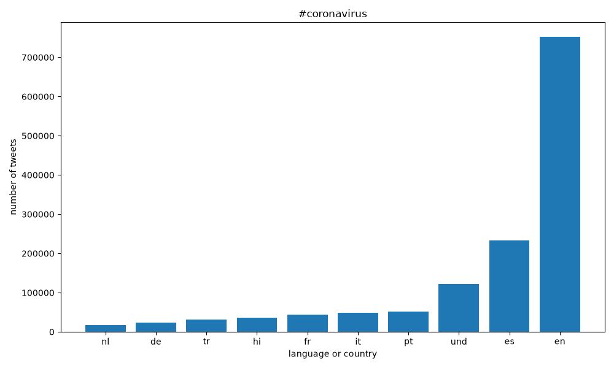
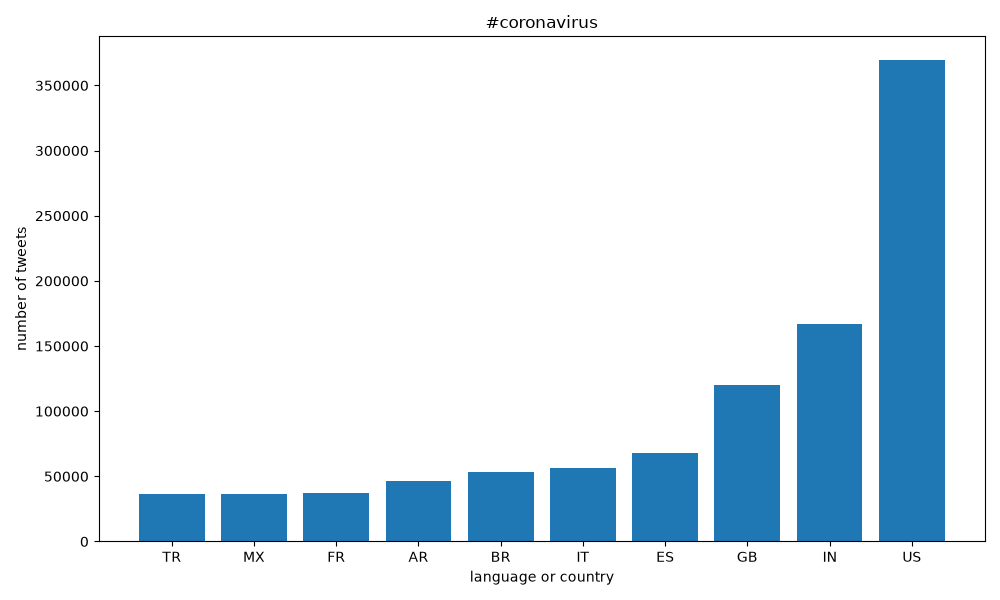
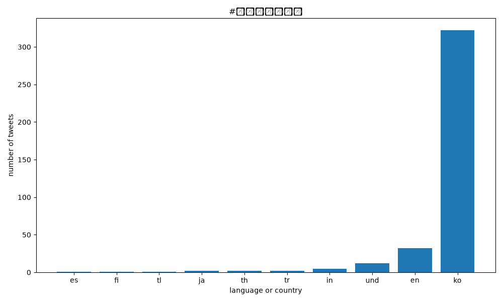
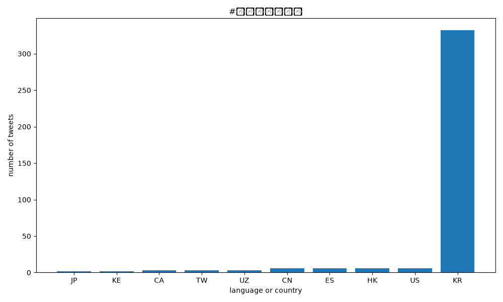
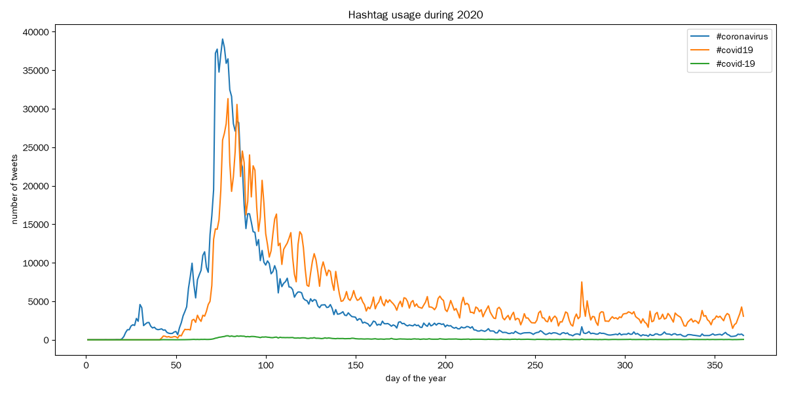

# Coronavirus Twitter Analysis

I analyzed every geotagged tweet sent in 2020 (about 1.3 billion tweets) to see how coronavirus-related hashtags spread across languages and countries. I used the MapReduce approach so the work could run in parallel.

## How it works
- `src/map.py` processes one day of tweets and counts each hashtag by language and by country. `run_maps.sh` launched all 366 days in parallel with `nohup`.
- `src/reduce.py` adds the 366 daily results into one total for languages and one for countries.
- `src/visualize.py` plots the top 10 languages or countries for a hashtag.
- `src/alternative_reduce.py` plots how often hashtags were used on each day of the year.

## Results

`#coronavirus` was used most in English (about 750,000 tweets) and from the United States (about 370,000). The Korean hashtag was almost only used in Korean and from South Korea, but in small numbers because few Korean users geotag their tweets.

